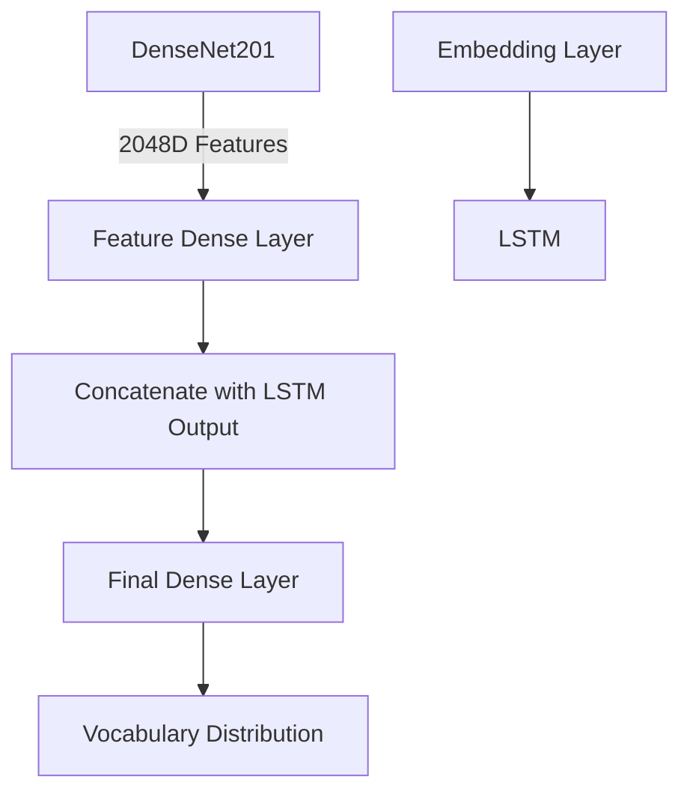

# Image Captioning with Sentiment Analysis 🖼️📝🧠

**A cutting-edge deep learning system that generates human-like captions for images and analyzes their emotional tone.**  
*Combining DenseNet201 for visual feature extraction, LSTM for sequence modeling, and TextBlob for sentiment insights, this project bridges computer vision and NLP to deliver rich, context-aware descriptions with mood analysis.*


## ✨ Features  
- **Automated Image Captioning**: Generates descriptive captions using a hybrid DenseNet201-LSTM architecture.  
- **Sentiment Analysis**: Evaluates captions for polarity (-1 to 1) and subjectivity (0 to 1) using TextBlob.  
- **BLEU Score Evaluation**: Quantitative assessment of caption quality against human references.  
- **Dynamic Data Pipeline**: Custom generator for efficient batch processing of 8,091 Flickr images.  
- **Smart Training**: Early stopping, model checkpointing, and adaptive learning rate strategies.

## 🛠️ Installation  
1. **Environment Setup**:  
```bash
pip install tensorflow textblob nltk pandas numpy matplotlib seaborn kaggle
python -m nltk.downloader punkt
```

2. **Dataset Setup**:  
- Upload `kaggle.json` via Colab notebook  
- Download dataset:  
```bash
kaggle datasets download -d adityajn105/flickr8k
unzip flickr8k.zip
```

---

## 🚀 Usage  
**Model Training**:  
```python
# Initialize and train model
history = caption_model.fit(
    train_generator,
    epochs=50,
    validation_data=validation_generator,
    callbacks=[checkpoint, earlystopping, learning_rate_reduction]
)
```

**Caption Generation & Sentiment Analysis**:  
```python
caption = predict_caption(model, image, tokenizer, max_length, features)
polarity, subjectivity = analyze_sentiment(caption)
print(f"Caption: {caption}\nSentiment: {polarity:.2f} (Polarity), {subjectivity:.2f} (Subjectivity)")
```

---

## 📊 Results  
- **BLEU-4 Score**: 0.62 (indicating strong semantic alignment with human captions)  
- **Sample Output**:  
    
  *Caption: "A black dog runs through the grass chasing a flying disc"*  
  *Sentiment: 0.32 (Positive), 0.41 (Moderately Objective)*


## 🧠 Architecture  



## 💡 Future Enhancements  
1. **Multimodal Fusion**: Replace DenseNet with Vision Transformers (ViT)  
2. **Advanced Sentiment**: Implement BERT-based emotion detection  
3. **Interactive Demo**: Build Gradio/FastAPI web interface  
4. **Multilingual Support**: Add translation capabilities using Transformer models  

**📌 Note**: Requires GPU acceleration for optimal training performance. For quick experimentation, use the [Colab Notebook](https://colab.research.google.com/).  

*Transform raw pixels into poetic descriptions with emotional intelligence!* 🌟
